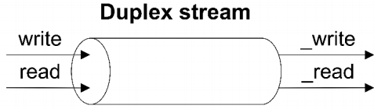
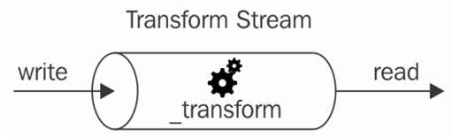

### 6-2-5 Transform 스트림
- *데이터 변환을 처리*하도록 설계된 특수한 종류의 Duplex 스트림
  - ex) zlib.createGzip(), crypto.createCipheriv() 함수는 각각 압축 및 암호화를 위한 Transform 스트림을 생성 
- Writable 쪽에서 각 데이터 청크에 일종의 변환을 적용한 다음, 변환된 데이터를 Readable 쪽에서 사용할 수 있도록 함
  - Duplex는 들어오는 데이터를 쓰기, 내보내는 데이터를 읽기 작업을 처리할 뿐, 스트림 내부에서 어떠한 가공처리를 하진 않는다.
    소켓을 생각해보라. 소켓이 주고 받는 데이터를 가공하진 않는다. 그냥 전송하고 수신할뿐.
  
  

#### Transform 스트림의 구현
다음 두 가지를 구현해야 한다.
1. `_transform()`
   - Writable 스트림의 `_write()` 함수와 거의 동일한 특성.
   - 리소스에 데이터를 쓰는 대신, Readable 스트림의 `_read()`처럼 `this.push()`를 사용하여 내부 읽기 버퍼로 데이터를 밀어 넣음 
2. `_flush()`를 구현해야 함
   - 스트림이 종료되기 전에 호출됨.
   - 여기서 스트림을 완료하거나 스트림을 완전히 종료하기 전에 남은 데이터를 푸시하는 마지막 기회를 가짐.

#### Transform 스트림을 사용한 데이터 필터링 및 집계
- Transform 스트림을 사용하여 다른 유형의 데이터 변환을 구현할 수 있음
  - ex) 데이터 필터링 및 데이터 집계를 구현하는 것이 일반적
